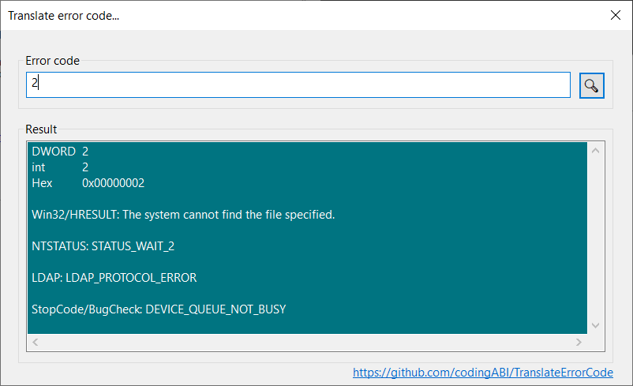

# TranslateErrorCode
A Windows GUI tool to translate a numeric standard error code to the corresponding text.

It supports error codes from
- Win32/HRESULT
- NTSTATUS
- Windows Update
- LDAP
- StopCode/BugCheck 
- Wininet



## License and copyright
This project is licensed under the terms of the CC0 [Copyright (c) 2024 codingABI](LICENSE). 

- Icon for the app: Modified icon "zoom" from Game icon pack by Kenney Vleugels (www.kenney.nl), https://kenney.nl/assets/game-icons, CC0
- Special callback function for the input edit control: Raymond Chen, https://devblogs.microsoft.com/oldnewthing/20190222-00/?p=101064

## Appendix

### Statistics for supported error codes

| From  | Number of supported error codes | Source |
| ------------- | -------------: | ---------- | 
| Win32/HRESULT  | 12990  | Counted on a Windows 11 23H2 computer |
| NTSTATUS  | 2860  | Counted on a Windows 11 23H2 computer |
| Windows Update  | 474  | wuerror.h (From Windows SDK 10.0.26100.1) |
| LDAP  | 63  | Winldap.h (From Windows SDK 10.0.26100.1) |
| StopCode/BugCheck  | 377  | https://learn.microsoft.com/en-US/windows-hardware/drivers/debugger/bug-check-code-reference2 |
| Wininet  | 100  | wininet.h (From Windows SDK 10.0.26100.1) |
Tobal number: ~16800

### External references

https://learn.microsoft.com/en-us/openspecs/windows_protocols/ms-erref

https://learn.microsoft.com/en-us/windows-hardware/drivers/debugger/bug-check-code-reference2

### Development environment

Visual Studio 2022

The C++ code works without special frameworks and uses only the Win32 API.

### Digitally signed binaries
The compiled EXE files are digitally signed with my public key 
```
30 82 01 0a 02 82 01 01 00 a1 23 c9 cc ed e5 63 3a 68 d8 48 ea 8e eb fe 6d c5 59 73 7d ff 4d 6a 60 4e a6 5f b3 3a c6 1c 68 37 fa 3d 5f 76 5e 7a ad 70 cb 07 b7 21 da b6 29 ca 49 2b 8f 3f 2a 0c b4 f8 d1 c4 7b ac 45 59 0d fb 29 e1 9c bb fc e7 fb 8c ce 7a c2 5c 14 58 71 c0 25 41 c0 4e c4 f3 31 3e d3 05 5a 71 00 4e 0e 27 92 b3 f3 bb c5 bf 8b 1c fc 2f 69 50 d4 90 be e2 d6 82 44 a4 6e 67 80 b1 e8 c8 9d 1b 3a 56 a4 8c bf ec 19 9e cd ab 2d 46 fd f7 c7 67 b6 eb fb aa 18 b0 07 21 1b 79 a5 98 e0 7d c7 4d 31 79 47 9c 24 83 61 f3 63 b8 ec cc 62 42 6b 80 9a 74 0b 40 33 bd d1 cb 55 28 80 39 85 89 0c 19 e2 80 cb 39 e5 1b 38 d6 e6 87 a7 af ea 6e f9 df 89 79 fc ac f1 15 a2 58 55 df 27 d6 19 54 a1 91 52 41 eb 1d ad 3b 20 2c 50 e5 a3 c1 59 a4 a7 bb 6f 22 01 bb 46 bf e0 66 fb 82 ee dc 03 a7 8a e5 33 af 75 02 03 01 00 01
```
Do not run code/binaries, you dont trust!
